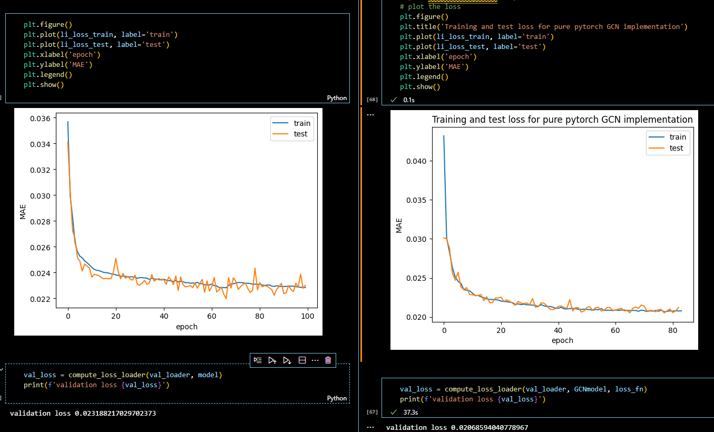

# Pytoch GCN

Reimplementing GCNs in pytorch

We compared ou raw pytorch implementation with existing ones from torch geometric.

# Dataset

We used the QM9 dataset from torch geometric. 

# References
1. Kipf, T. N., & Welling, M. (2016). Semi-Supervised Classification with Graph Convolutional Networks. arXiv preprint arXiv:1609.02907.

